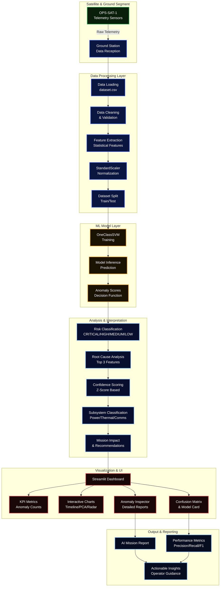

# 🛰️ MIRA — Mission Intelligence & Risk Analyzer

<div align="center">


**MIRA** is an AI-powered satellite anomaly detection and investigation system that transforms raw telemetry anomalies into actionable mission insights.

</div>

---

## 🚀 Features

- ✅ **Anomaly Detection**: Uses One-Class SVM to identify abnormal satellite telemetry patterns
- ✅ **Investigation Report**: Automatically explains the likely root cause of each anomaly
- ✅ **Root Cause Confidence**: Provides confidence scores for each identified root cause
- ✅ **Subsystem Classification**: Automatically classifies affected subsystems (Power, Thermal, Comms, etc.)
- ✅ **Recommendations**: Provides actionable steps for mission operators
- ✅ **Mission Impact**: Assesses the impact of anomalies on mission objectives
- ✅ **Channel Selection**: Analyze different satellite channels independently
- ✅ **Interactive UI**: Built with Streamlit for ease of use
- ✅ **Multiple Modes**: Supports both Real OPS-SAT data and Synthetic Simulation
- ✅ **Confusion Matrix**: Model performance evaluation with ground truth

---

## 🧠 How It Works

1. **Data Input**: Reads satellite telemetry from `dataset.csv` or generates synthetic data
2. **Preprocessing**: Standardizes the telemetry features using `StandardScaler`
3. **Model**: Uses One-Class SVM (nu=0.22, RBF kernel) to detect anomalies
4. **Risk Classification**: Categorizes anomalies into CRITICAL/HIGH/MEDIUM/LOW risk levels
5. **Root Cause Analysis**: Generates rule-based explanations for each detected anomaly
6. **Mission Recommendations**: Suggests next steps for mission operators

---

## 📊 Model Performance

> Evaluated on the ESA OPS-SAT-1 telemetry dataset.

| Metric | Score |
|--------|-------|
| **Accuracy** | 76.94% |
| **F1 Score** | 46.96% |
| **Model** | One-Class SVM with RBF kernel |
| **Nu** | 0.22 |
| **Training Data** | Normal telemetry only (train=1, anomaly=0) |

---

## 🖥️ UI Features

### 📊 Overview Tab
- Mission Status Banner (CRITICAL/HIGH/MEDIUM/LOW/NOMINAL)
- KPI Metrics (Segments, Normal, Anomalies, Risk Levels)
- Mission Intelligence Summary with Recommendations

### 🔬 Anomaly Inspector Tab
- Interactive selection of anomalies
- Root Cause Analysis (Top 3 features)
- Confidence Scores for each cause
- Subsystem Classification
- Mission Impact & Actions
- Deviation Radar Chart
- Feature Comparison Table

### 📈 Charts Tab
- Anomaly Score Timeline
- PCA Feature Space Visualization
- Full Telemetry Heatmap

### 📋 Model Info Tab
- Model Card with parameters
- Confusion Matrix
- Precision/Recall/F1 Metrics

### ⚠️ Limitations Tab
- Comprehensive list of model limitations

---

## 🛠️ Technologies Used

- **Python** 3.9+
- **Streamlit** 1.28+
- **Pandas** 2.0+
- **NumPy** 1.24+
- **Scikit-learn** 1.3+
- **Plotly** 5.18+

---

## 🤖 How IBM Bob Was Used

IBM Bob was used as the **primary AI development assistant** throughout the project. Specifically, Bob was utilized to:

- 🧠 **Generate and refine** Python code for data preprocessing, anomaly detection (One-Class SVM), and the Streamlit interface
- 🐛 **Debug and fix errors** during development (e.g., Streamlit installation issues, model training pipelines)
- 💡 **Suggest improvements** to the anomaly detection model and the root-cause explanation logic
- 📝 **Draft documentation** for the project, including this README
- 🏗️ **Design architecture** for the application with Mermaid diagrams
- 🎨 **Create UI/UX** with dark space theme and interactive visualizations

---

## 📂 Project Structure

```
MIRA-Satellite-Anomaly-Investigator/
├── app.py                 # Main Streamlit application
├── dataset.csv            # Satellite telemetry dataset
├── requirements.txt       # Python dependencies
└── README.md              # Project documentation
```

---

## 📦 Requirements

```
streamlit>=1.28
pandas>=2.0
numpy>=1.24
scikit-learn>=1.3
plotly>=5.18
```

---

## 🏗️ Architecture



---

## 🚀 How to Run

### Prerequisites

- Python 3.9+
- pip

### Installation

```bash
git clone https://github.com/ShadenBawazir/MIRA-Satellite-Anomaly-Investigator.git
cd MIRA-Satellite-Anomaly-Investigator
pip install -r requirements.txt
```

### Run

```bash
streamlit run app.py
```

---

## ⚠️ Limitations

- One-Class SVM only learns from normal data, cannot distinguish anomaly types
- Results depend on training dataset completeness and quality
- Normal seasonal variations may be flagged as anomalies
- Risk thresholds are heuristic and may need per-mission tuning

---
## 🎥 Demo

Demo video: [Watch MIRA Demo](https://youtu.be/SLFA2Bq9u98)

## 🚀 Live App

[Streamlit App](https://mira-satellite-anomaly-investigator-fmq5jcvybztm9vfxpdmrga.streamlit.app/)

---
## 📧 Contact

**Shaden Bawazir**

- GitHub: [ShadenBawazir](https://github.com/ShadenBawazir)
- Project: [MIRA-Satellite-Anomaly-Investigator](https://github.com/ShadenBawazir/MIRA-Satellite-Anomaly-Investigator)

---

© 2025 MIRA — Mission Intelligence & Risk Analyzer
