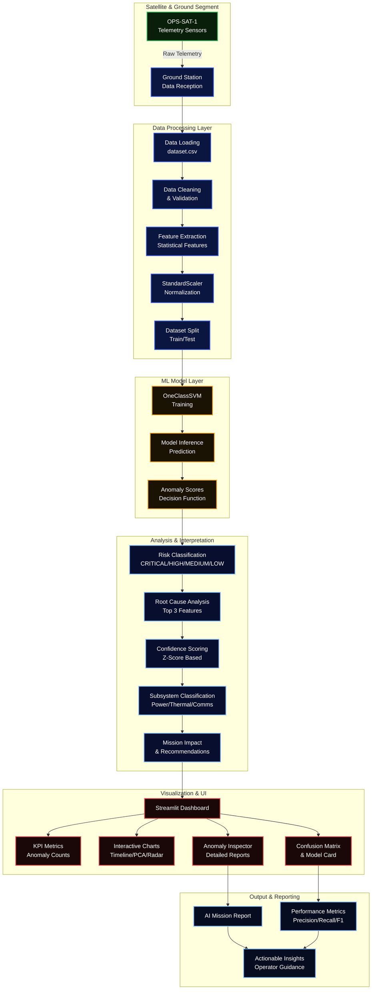

# 🛰️ MIRA — Mission Intelligence & Root-cause Analyzer

MIRA is an AI-powered satellite anomaly detection and investigation system that transforms raw telemetry anomalies into actionable mission insights.

## 🚀 Features
- **Anomaly Detection**: Uses One-Class SVM to identify abnormal satellite telemetry patterns.
- **Investigation Report**: Automatically explains the likely root cause of each anomaly.
- **Recommendations**: Provides actionable steps for mission operators.
- **Channel Selection**: Analyze different satellite channels independently.
- **Interactive UI**: Built with Streamlit for ease of use.

## 🧠 How It Works
1. **Data Input**: Reads satellite telemetry from `dataset.csv`.
2. **Preprocessing**: Standardizes the telemetry features.
3. **Model**: Uses One-Class SVM (nu=0.22) to detect anomalies.
4. **Explanation**: Generates a rule-based root-cause explanation for each detected anomaly.
5. **Recommendations**: Suggests next steps for mission operators.

## 📊 Model Performance
- **Accuracy**: 76.94%
- **F1 Score**: 46.96%
- **Model**: One-Class SVM with RBF kernel

## 🛠️ Technologies Used
- Python
- Streamlit
- Pandas
- NumPy
- Scikit-learn

## 🤖 How IBM Bob Was Used
IBM Bob was used as the primary AI development assistant throughout the project. Specifically, Bob was utilized to:
- Generate and refine Python code for data preprocessing, anomaly detection (One-Class SVM), and the Streamlit interface.
- Debug and fix errors during development (e.g., Streamlit installation issues, model training pipelines).
- Suggest improvements to the anomaly detection model and the root-cause explanation logic.
- Draft documentation for the project, including this README.

## 📂 Project Structure
MIRA-Satellite-Anomaly-Investigator/
├── app.py # Main Streamlit application
├── dataset.csv # Satellite telemetry dataset
├── requirements.txt # Python dependencies
└── README.md # Project documentation

# MIRA-Satellite-Anomaly-Investigator

MIRA is a satellite anomaly detection system powered by OneClassSVM.

## 🏗️ Architecture


## 🚀 How to Run
1. Clone the repository:
   ```bash
   git clone https://github.com/ShadenBawazir/MIRA-Satellite-Anomaly-Investigator.git
Install dependencies:


pip install -r requirements.txt
Run the app:


streamlit run app.py
📧 Contact
Shaden Bawazir
GitHub
